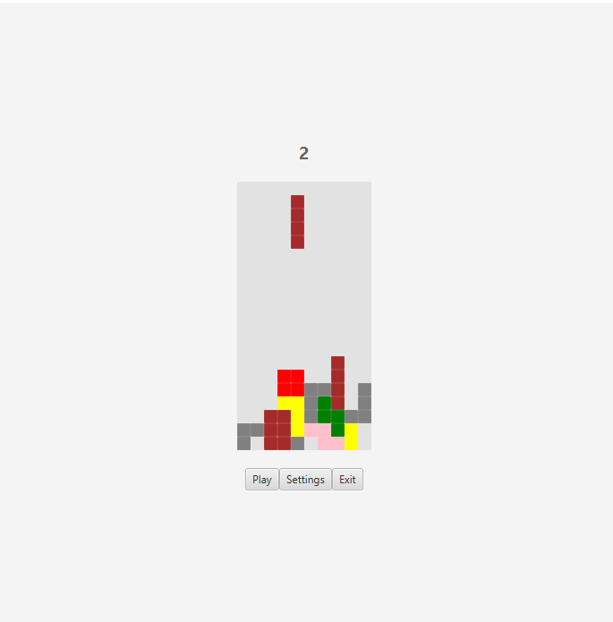

# Tetris
Tetris is a game we re-created for my Software Maintenance and Reengineering class. The game we choose to re-create was called Kentris (Tetris was not listed out of all the games we could have chosen), which is why there is mention of it in the project files, but we were allowed to re-create Tetris rather than Ketris because it would have been too much work for the semester because Kentris has multiplayer functionality. We used JavaFX to create Tetris.

# Our team: Team 05

The following people worked on this project:
* Sean Maidana Dollanarte
* Jon Olson
* Blake Tucker
* [Tim Lima](https://github.com/tlima2019)
* Reese Wunderlich

# Where are the files located? 
[Tetris/src/main/java/edu/uwplatt/team05/](https://github.com/gcmaidana/Tetris/tree/main/src/main/java/edu/uwplatt/team05)

# Running the program
To run the program, run the JAR file, [team05.jar](https://github.com/gcmaidana/Tetris/blob/main/team05.jar)

Feel free to try to run the program in an IDE (we used IntelliJ), but it may be a pain to set up because of all the cofigurations you may need to set up.
I suggest just running the JAR file, as it is easiest. 

